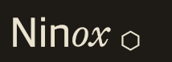

# Ninox

Ninox is the native desktop app for [Athene](https://github.com/Made-by-Moonlight/Athene) — built in Rust with [Iced](https://github.com/iced-rs/iced). It embeds its own orchestrator engine directly and runs a GPU-accelerated UI: no Electron, no bundled browser.

The app and Athene's Node.js stack **work in tandem**. Running Ninox starts a fresh engine with its own SQLite store and HTTP server; the Athene web dashboard continues to work against either backend unchanged.

> This repo was split out of the [Athene](https://github.com/Made-by-Moonlight/Athene) monorepo's `athene/` directory, history intact. Crates and identifiers have since been renamed from `athene-*` to `ninox-*`.

## Prerequisites

- Rust toolchain: `curl --proto '=https' --tlsv1.2 -sSf https://sh.rustup.rs | sh`
- macOS or Linux (Windows not yet supported)

## Install

```bash
cargo install ninox
```

## Build and run

```bash
cargo build --release -p ninox

# Run with native UI (requires display)
./target/release/ninox

# Run headless (engine + HTTP API only, no window)
./target/release/ninox --headless

# Custom port and database path
./target/release/ninox --port 9090 --db ~/.local/share/ninox/ninox.db
```

The HTTP server always starts on `127.0.0.1:8080` (or `--port`). Athene's web dashboard can connect to it at that address exactly as it connects to the Node.js backend.

## Configuration

App config is stored at `~/.config/ninox/config.toml`:

```toml
port = 8080
font_size = 13.0
```

## Development

```bash
cargo build                    # Debug build (all crates)
cargo test                     # Run all crate tests
cargo run -p ninox             # Run with native UI
cargo run -p ninox -- --headless  # Run headless (engine + HTTP only)
```

## Crates

| Crate | Purpose |
|---|---|
| `ninox-core` | Engine: session lifecycle, config, storage |
| `ninox-server` | HTTP/WebSocket server exposing the engine |
| `ninox` | Native Iced UI + binary entry point |

## License

MIT
