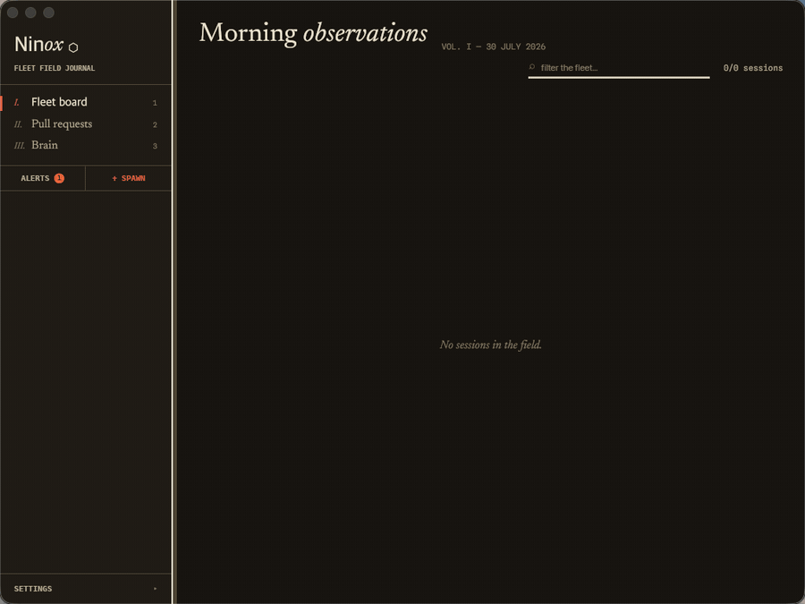

# Ninox

A native desktop cockpit for running fleets of coding agents.



## What is Ninox?

Running one coding agent in a terminal is fine. Running five of them across three repos is a wall of terminal tabs with no overview, no shared memory, and no record of what any of them cost. Ninox is a desktop app that turns that mess into a fleet you can actually supervise:

- **Orchestrators and workers** — spawn an orchestrator with a goal and it breaks the work down, spawning worker sessions to execute in parallel. Workers that discover extra work hand it back to the orchestrator (`ninox request-work`) rather than going off-script. Standalone sessions are there for when you just want one agent in one repo.
- **Everything on one board** — a fleet board shows every session at a glance; click through to a live embedded terminal for any of them. Sessions run on a private tmux server, so they keep working when you close the app and are still there when you come back.
- **Isolated by default** — sessions in a git repo get their own worktree, so parallel agents never trample each other's changes.
- **A shared brain** — a plain-Markdown knowledge base that agents query before exploring unfamiliar code and write to before finishing. Knowledge discovered in one session stops being rediscovered in the next. It's just files — commit it, diff it, or point Ninox at an existing Obsidian vault. See [docs/BRAIN.md](docs/BRAIN.md).
- **The boring-but-vital extras** — PR tracking for session branches, per-session cost estimates and context usage, and desktop notifications when a session needs you.

Ninox is built in Rust with [Iced](https://github.com/iced-rs/iced): a GPU-accelerated native UI with its own embedded engine and SQLite store — no Electron, no bundled browser. [Claude Code](https://claude.com/claude-code) is the first-class harness; codex, opencode, aider, and custom harnesses can be enabled via config. Note that worker sessions run unattended with permission prompts bypassed (`--dangerously-skip-permissions` for Claude Code) — spawn fleets in repositories you trust.

## Why use it?

Use Ninox when you've outgrown a single agent in a single terminal:

- You want several agents working in parallel without babysitting each one.
- You want sessions that survive app restarts (and laptops going to sleep).
- You want your agents to accumulate knowledge about your codebases instead of starting cold every session.
- You want one place to see what's running, what it's doing, and what it has cost.

## Prerequisites

- Rust toolchain: `curl --proto '=https' --tlsv1.2 -sSf https://sh.rustup.rs | sh`
- tmux 3.2+ (3.5+ recommended for full extended-keyboard support)
- macOS or Linux (Windows not yet supported). Ubuntu 22.04 and newer are
  supported and covered by CI; on Debian/Ubuntu install the build
  dependencies first:

  ```bash
  sudo apt-get install -y build-essential pkg-config cmake \
    libxkbcommon-dev libwayland-dev
  ```

  No OpenSSL headers are required — all TLS goes through rustls.

## Install

```bash
cargo install ninox
```

## Build and run

```bash
cargo build --release -p ninox

# Run with native UI (requires display)
./target/release/ninox

# Run headless (engine + HTTP API only, no window)
./target/release/ninox --headless

# Custom port and database path
./target/release/ninox --port 9090 --db ./ninox.db
```

The HTTP server always starts on `127.0.0.1:8080` (or `--port`), exposing the engine's HTTP/WebSocket API — so everything the UI does is also scriptable.

## Terminal mode

Ninox also offers a terminal UI (TUI) for SSH access or headless environments. The TUI is available via `ninox tui` on any platform; on Linux and SSH (where there is no display), `ninox` with no arguments automatically opens the TUI instead of the native window.

On macOS, `has_display()` is hardcoded `true`, so bare `ninox` always opens the native GUI — use `ninox tui` explicitly if you want the terminal interface instead.

### Terminal commands

```bash
# Start the terminal UI
ninox tui

# List running sessions (--json for machine-readable output)
ninox list [--json]

# Connect to an existing session
ninox connect <session-id>

# Spawn a new orchestrator session
ninox orchestrate <name> [--prompt <brief>] [--no-attach]
```

The daemon automatically starts in the background on first use and logs to `~/.local/share/ninox/daemon.log` (Linux) or `~/Library/Application Support/ninox/daemon.log` (macOS). Quitting the TUI doesn't shut down the daemon — sessions continue running in the background.

## macOS app bundle

Every [tagged release](https://github.com/Made-by-Moonlight/ninox/releases) has a prebuilt `Ninox.app.zip` attached as a release asset — download it, unzip, and drag `Ninox.app` into `/Applications`. No local Rust toolchain needed.

The bundle is ad-hoc code-signed in CI (no paid Apple Developer ID or notarization), which is enough to stop Gatekeeper from calling it "damaged" after a browser download. It's not enough to clear the separate "unidentified developer" warning macOS shows the first time you open an app from outside the App Store — that only goes away with real notarization. The first time you launch `Ninox.app`, expect that prompt; get past it with either:

- Right-click (or Control-click) `Ninox.app` → **Open** → **Open** in the confirmation dialog, or
- **System Settings** → **Privacy & Security** → scroll to the blocked-app notice → **Open Anyway**

You only need to do this once per download.

To build it yourself instead — to get a proper `Ninox.app` that shows up in the Dock and Launchpad with its own icon (instead of running as a bare binary) — build it with [`cargo-bundle`](https://github.com/burtonageo/cargo-bundle):

```bash
cargo install cargo-bundle

# Run from the repo root — bundle asset paths in crates/ninox-app/Cargo.toml
# are resolved relative to the current working directory, not the crate dir.
cargo bundle --release -p ninox --format osx
```

This produces `target/release/bundle/osx/Ninox.app`, which you can open directly or drag into `/Applications`:

```bash
open target/release/bundle/osx/Ninox.app
```

Bundle metadata (name, identifier, icon) lives under `[package.metadata.bundle]` in `crates/ninox-app/Cargo.toml`. The icon source is `crates/ninox-app/assets/icon-1024.png`; the compiled `crates/ninox-app/assets/Ninox.icns` is generated from it with `sips` + `iconutil` (regenerate after changing the source image):

```bash
cd crates/ninox-app/assets
rm -rf Ninox.iconset && mkdir Ninox.iconset
for size in 16 32 128 256 512; do
  sips -z $size $size icon-1024.png --out Ninox.iconset/icon_${size}x${size}.png
  sips -z $((size*2)) $((size*2)) icon-1024.png --out Ninox.iconset/icon_${size}x${size}@2x.png
done
iconutil -c icns Ninox.iconset -o Ninox.icns
rm -rf Ninox.iconset
```

## Installation

This is the private mirror of ninox — the sections above cover the public
build/install paths (crates.io, the public repo's GitHub Releases). Internal
engineers have two additional options: building from source against this
repo's history, and pulling prebuilt crates from Synthesia's private Cargo
registry.

### Build from source

MSRV is rustc **1.94.0** (pinned in `Cargo.toml` — a transitive `aws-config`
dependency bump requires 1.94.1+, so the workspace stays on 1.94.0 until the
toolchain catches up). Install it and build as in [Build and
run](#build-and-run) above:

```bash
rustup install 1.94.0
cargo +1.94.0 build --release -p ninox
```

### Prebuilt macOS bundle (private mirror)

This repo publishes its own GitHub Releases too — the `release` job in
[`.github/workflows/publish-codeartifact.yml`](.github/workflows/publish-codeartifact.yml)
builds, ad-hoc signs, and attaches `Ninox.app.zip` to a release on *this*
repo for every version tag, so internal engineers don't need to go to the
public repo for it. Same install steps as [macOS app bundle](#macos-app-bundle)
above, just from this repo's Releases page instead.

### Installing from Synthesia's private Cargo registry

Internal-only commits (merged directly to this repo, not yet synced to the
public one) get published to `ninox` / `ninox-core` / `ninox-server` crates
on Synthesia's CodeArtifact Cargo registry (`synthesia-cargo`, in the
`synthesia-build` domain) before they ever reach crates.io. To pull from it
instead of building from source, you first need an AWS SSO profile with
access to the account that owns that domain — ask your team if you don't
have one already, and run `aws sso login --profile <your-build-profile>` if
your session has expired.

If you already have Synthesia's `ca-keyring` dev-tooling script, it sets
all of this up in one command (defaults already point at
`synthesia-build`/`synthesia-cargo`):

```bash
ca-keyring -C
```

Otherwise, configure Cargo by hand — add a registry entry to
`~/.cargo/config.toml` that points at the repository's sparse index and
mints a fresh CodeArtifact token on demand via a `cargo:token-from-stdout`
credential provider, so nothing is ever written to disk and there's no
token to accidentally commit:

```toml
[registries.synthesia-cargo]
index = "sparse+https://synthesia-build-<domain-owner-account-id>.d.codeartifact.eu-west-1.amazonaws.com/cargo/synthesia-cargo/"
credential-provider = "cargo:token-from-stdout aws codeartifact get-authorization-token --domain synthesia-build --domain-owner <domain-owner-account-id> --region eu-west-1 --profile <your-build-profile> --query authorizationToken --output text"
```

Get `<domain-owner-account-id>` and the index URL at setup time instead of
hardcoding them — they're derivable from your own credentials, not a secret
worth pasting around:

```bash
DOMAIN_OWNER=$(aws sts get-caller-identity --profile <your-build-profile> --query Account --output text)
aws codeartifact get-repository-endpoint \
  --domain synthesia-build --domain-owner "$DOMAIN_OWNER" \
  --repository synthesia-cargo --format cargo \
  --profile <your-build-profile> --query repositoryEndpoint --output text
```

Then install:

```bash
cargo install --registry synthesia-cargo ninox
```

Cargo sends the CodeArtifact token verbatim in the `Authorization` header
with no `Bearer` prefix — the credential provider above already does this
correctly, but if you're scripting the token fetch by hand, don't add one.

If you'd rather use a static token instead of the on-demand provider (e.g.
for a one-off `cargo add`), swap the registry's credential provider to plain
`cargo:token` — the `token-from-stdout` provider used above doesn't support
`cargo login` at all, it only mints tokens for cargo's own requests:

```toml
[registries.synthesia-cargo]
index = "sparse+https://synthesia-build-<domain-owner-account-id>.d.codeartifact.eu-west-1.amazonaws.com/cargo/synthesia-cargo/"
credential-provider = "cargo:token"
```

Then pipe in a freshly fetched token — `cargo login` reads it from stdin, no
positional argument needed. Expect to redo this whenever it expires
(CodeArtifact tokens are short-lived, typically ~12 hours):

```bash
aws codeartifact get-authorization-token \
  --domain synthesia-build --domain-owner "$DOMAIN_OWNER" \
  --profile <your-build-profile> --query authorizationToken --output text \
  | cargo login --registry synthesia-cargo
```

## Configuration

App config lives in the platform config directory — `~/Library/Application Support/ninox/config.toml` on macOS, `~/.config/ninox/config.toml` on Linux (override with `NINOX_CONFIG`):

```toml
port = 8080
font_size = 13.0
```

PR tracking needs a GitHub token: set `github_token` in the config file or export `GITHUB_TOKEN`. Without it, PR status simply won't populate.

## Development

```bash
cargo build                    # Debug build (all crates)
cargo test                     # Run all crate tests
cargo run -p ninox             # Run with native UI
cargo run -p ninox -- --headless  # Run headless (engine + HTTP only)
```

## Crates

| Crate | Purpose |
|---|---|
| `ninox-core` | Engine: session lifecycle, brain, config, storage |
| `ninox-server` | HTTP/WebSocket server exposing the engine |
| `ninox` | Native Iced UI + binary entry point |

## License

MIT
